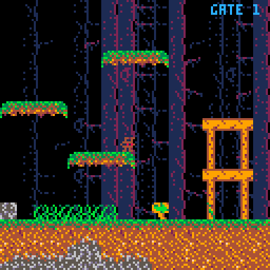

# pico8

Pico8 things, nothing serious, just having fun playing around

## wonky.p8

[Nerdyteachers platformer](https://nerdyteachers.com/Explain/Platformer/)
implementation. With some extra things like parallax background, but
no ground textures. Ignore all the `rspr` functions, they were used in
`bunny.p8` instead, and `rspr4` had the best result/interface.

## bunny.p8

An older thing, with
[Sonic style sensors](https://info.sonicretro.org/SPG:Solid_Tiles#Sensors)
to make sprite properly track/tilt with terrain. This was my first
"thing" in pico8, and it was pretty fun to do.

