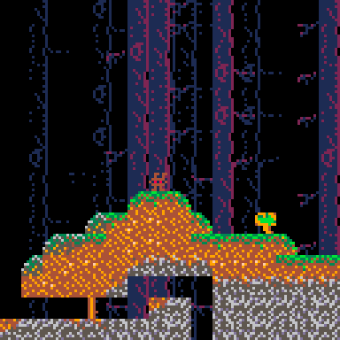

# pico8

Pico8 things, nothing serious, just having fun playing around

## wonky.p8

[Nerdyteachers platformer](https://nerdyteachers.com/Explain/Platformer/) implementation

## bunny.p8

An older thing, with
[Sonic style sensors](https://info.sonicretro.org/SPG:Solid_Tiles#Sensors)
to make sprite properly track/tilt with terrain.

